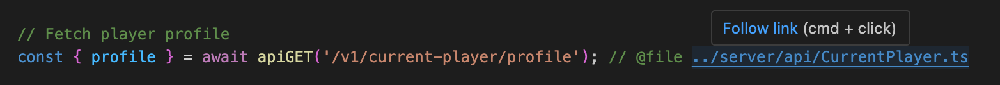
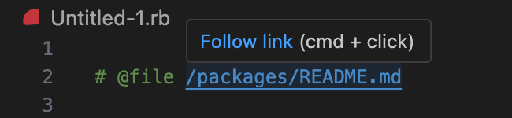

# file-link (VS Code Extension)

Link to other files within your project using relative paths. Follow links with Cmd + Click.



---



## How to use

Add links anywhere in your document. Start with the `@file` tag to identify that this is a link and then add the path to the file that you want to link to.

Paths that start with a slash `/` will be interpreted as relative to your project root, otherwise all paths will be treated as relative to the current document.

## Settings

Available in the VS Code > Settings menu

### "fileLink.linkRegex" 
Customize the Regular Expression that this extension uses to identify internal links within your documents

Default: `(@file )([^\\s]+)`
- Matches:
  - `@file /relative/to/project/root/file.md`
  - `@file relative/to/current-document/file.txt`
  - `@file ../relative/to/current-document/file.txt`

## Supported Document Languages

VS Code discourages extensions to activate all of the time using a wildcard, so this extension only activates for the following document types. Please request additional types and we can add them.

- dart
- go
- java
- javascript
- javascriptreact
- jsonc
- php
- python
- ruby
- typescript
- typescriptreact

## Installation

I would love to publish this on the VS Code Extensions Marketplace, but Azure has some terrible bug where even though I am the organization owner and admin I can't manage user account permissions to generate an access token to do this. I also can't create a support ticket because my account "needs to be added as an external user in the tenant first". Womp womp.

So, you'll have to install the extension manually using the .vsix file in this repo.

From the Extensions view in VS Code:

- Go to the Extensions view.
- Select Views and More Actions...
- Select Install from VSIX...

Or, from command palette:

- Cmd+Shift+P
- Select Extensions: Install from VSIX...

Or, from the command line:
```sh
code --install-extension vscode-file-link-[latest-version].vsix
```

## Dev Build
```sh
npx @vscode/vsce package
```
